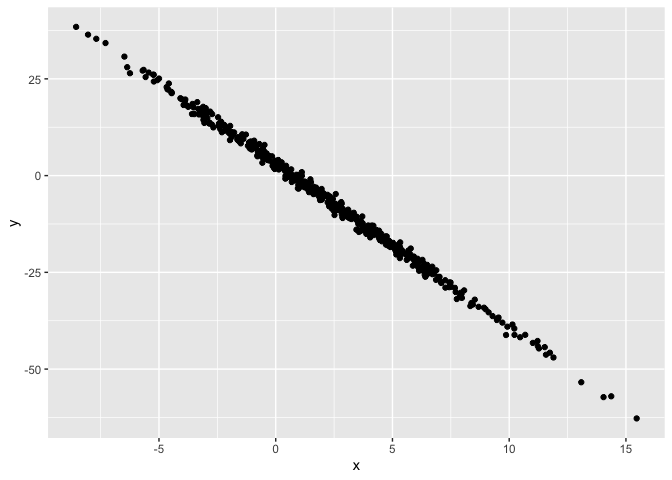

Simple document
================
AJ Catalano
28 October 2021

I’m an R Markdown document!

# Section 1

Here’s a **code chunk** that samples from a *normal distribution*:

``` r
samp = rnorm(100)
length(samp)
```

    ## [1] 100

# Section 2

I can take the mean of the sample, too! The mean is 0.1925322.

Code below creates a data frame and generates a plot.

“eval = FALSE” shows code without running it “echo = FALSE” runs code
without showing the code “message = FALSE” shows only output “include =
FALSE” acts as if code did not exist “collapse = TRUE” collapses all
output into one place not separated by code chunks

# Section 3

#### Plots

``` r
# comment for code chunk
library(tidyverse)
```

    ## ── Attaching packages ─────────────────────────────────────── tidyverse 1.3.1 ──

    ## ✓ ggplot2 3.3.5     ✓ purrr   0.3.4
    ## ✓ tibble  3.1.5     ✓ dplyr   1.0.7
    ## ✓ tidyr   1.1.4     ✓ stringr 1.4.0
    ## ✓ readr   2.0.2     ✓ forcats 0.5.1

    ## ── Conflicts ────────────────────────────────────────── tidyverse_conflicts() ──
    ## x dplyr::filter() masks stats::filter()
    ## x dplyr::lag()    masks stats::lag()

``` r
plot_df = tibble(
  x = rnorm(500, mean = 2, sd = 4),
  y = 3 - 4.2 * x + rnorm(500)
)

ggplot(plot_df, aes(x = x, y = y)) + geom_point()
```

<!-- --> This
plot is neat. It shows a linear relationship.

The data frame has 500 rows.

# Section 4

#### Making lists

Here is a list of things I like:

-   Techno
-   Synthesizers
    -   Analog
    -   Digital
    -   Modular
-   Drum machines

#### Table construction

| Col 1 | Col 2 |
|-------|-------|
| a     | b     |
| c     | d     |
| e     | f     |
